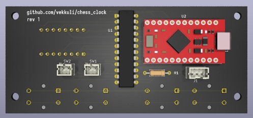
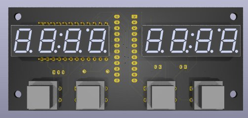
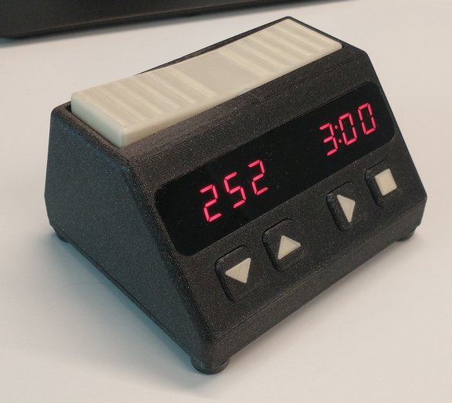
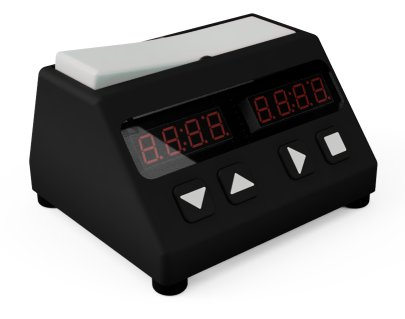
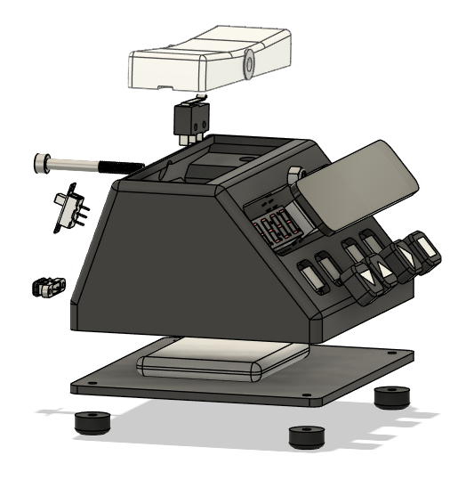

# Chess Clock :clock1:

This repo contains design and fabrication files for my DIY chess clock project. The main components in the design are

    Two 4-digit red 7-segment displays
    MAX7219 display driver
    Pro Micro microcontroller board
    3D printed enclosure and other parts
    5 V power supply (e.g. PowerBoost 500C and LiPoly battery)
    Cut-to-shape acrylic window and tint film

## PCB

The KiCad project can be found in [chess_clock_pcb](chess_clock_pcb) folder. The [fabrication files](chess_clock_pcb/fabrication) are also included and can be used to order the PCBs directly. The fabrication files were produced according to JLCPCB requirements. Black solder mask is recommended.

All the components are through-hole. Happy soldering! Just don't make the same mistake I did the first time and forget which side each component is supposed to be on :grin:. See the correct placement here:

 

*Note that the SW2 JST connector is not actually required. I put it there just in case but the current FW does not use it.*

## 3D printed parts

I used black PLA and white PETG. The main body was printed the display/button side facing down and using organic supports (PrusaSlicer). The following mesh files can be found in the [3d_print folder](3d_print):

    3d_print/bottom.3mf
    3d_print/bushing.3mf
    3d_print/button_type1.3mf
    3d_print/button_type1_fill.3mf
    3d_print/button_type2.3mf
    3d_print/button_type2_fill.3mf
    3d_print/main_body.3mf
    3d_print/rocking_switch.3mf

*Note that I actually used off-the-shelf plastic bushings that I just happened to have around, but I imagine 3D printed ones will work just as well.*

## Acrylic window

The acrylic window cut shape can be found in [3d_print/acrylic_cut.dxf](3d_print/acrylic_cut.dxf). 2 mm acrylic can be easily cut using for example a CO2 laser cutter.

The 5 % tint film (e.g. car window tint) is needed to get good contrast from the display.

## Bill of materials

Full (I hope) bill of materials below. Most parts can be sourced from DigiKey.

| Quantity  | Item                          | Info/part number/digikey          |
|-----------|-------------------------------|-----------------------------------|
| 2         | 4-digit CC 7-segment display  | TDCR1060M-ND                      |
| 1         | Display driver                | MAX7219CNG-ND                     |
| 1         | USB-C port for 5 V input      | 2057-USB-C20-S-VT-CS15-WP-BK-ND   |
| 1         | 10k 1/4W resistor             | Affects LED brightness            |
| 1         | JST PH 2-pos connector        | B2B-PH-K-S                        |
| 1         | JST PH 3-pos connector        | B3B-PH-K-S                        |
| 1         | Arduino Pro Micro board       | Microcontroller board             |
| 4         | Tactile switches              | SW414-ND                          |
| 1         | Omron limit switch            | SS-5GL13                          |
| 1         | PowerBoost 500C               | 5V supply and LiPoly charger      |
| 1         | LiPoly battery                | e.g. 3.7 V/2500 mAh               |
| 1         | M2.5 screws and nuts          |                                   |
| 1         | M3 screws and nuts            |                                   |
| 1         | M4x40 socket head screw       | Cut to about 36 mm (or use M4x35) |
| 1         | M4 nyloc nut                  |                                   |
| 1         | Acrylic window (2 mm)         | Laser cut to shape                |
| 1         | 5 % dark tint film            | Greatly improves display contrast |
| 2         | (optional) O-ring             | To soften the button press        |

## Pro Micro brownout fix :exclamation:

I don't know how they managed to mess this up :angry: but Pro Micro has a design flaw that causes it to brown out when started by applying power directly via either USB or VCC pin, i.e., not using the regulator on the board. One way to fix this, and what I did, is to remove the regulator IC. While at it, I decided to remove the tantalum capacitors as well.

## Images

